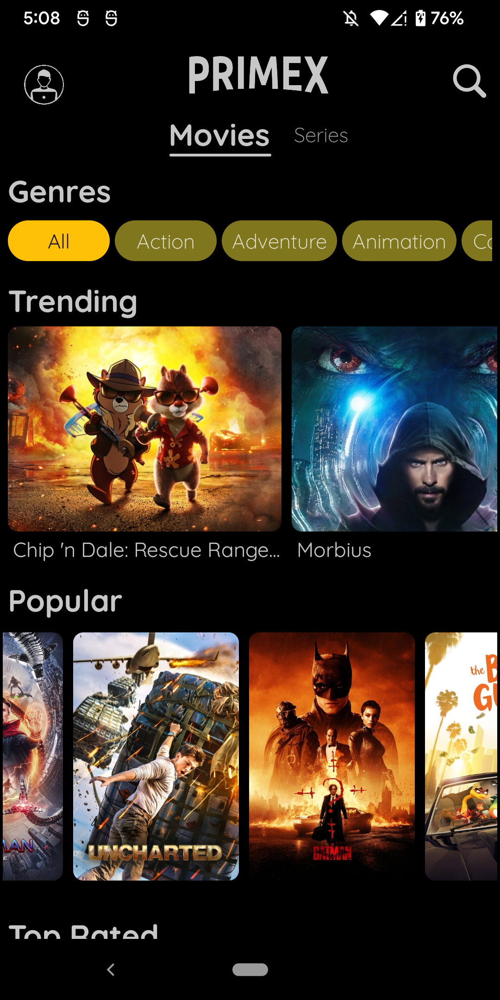
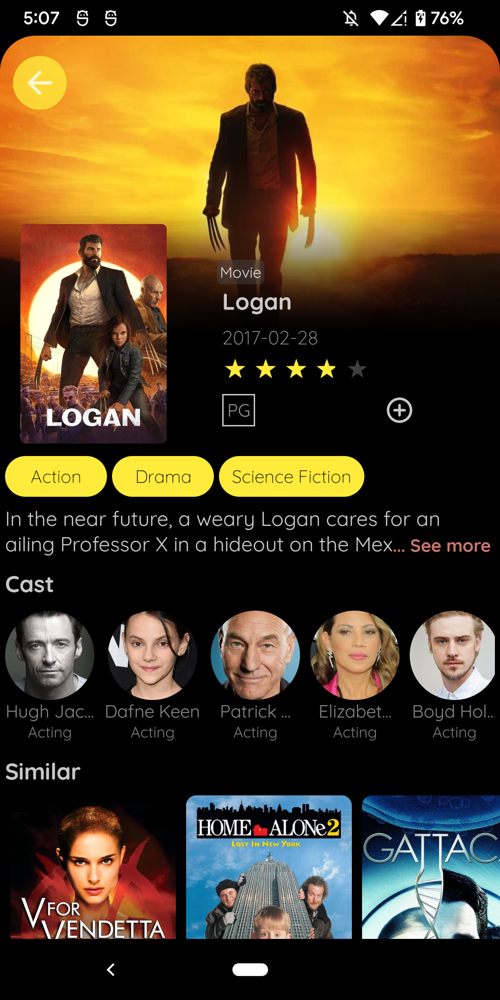
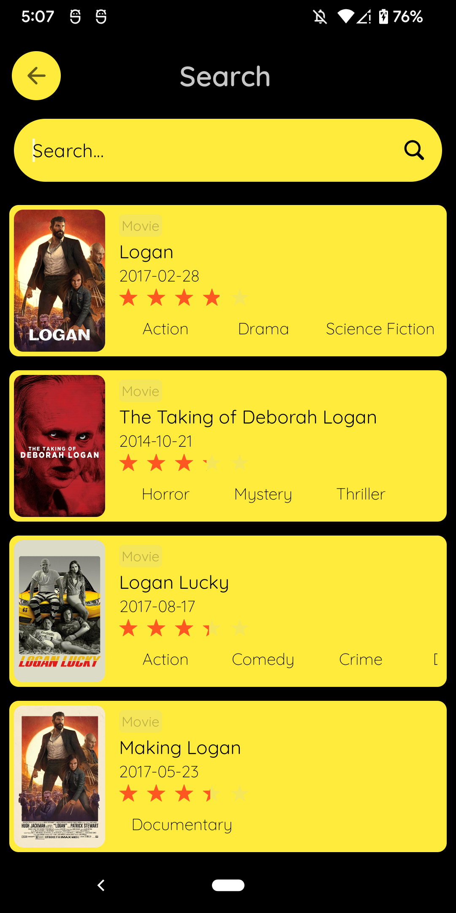
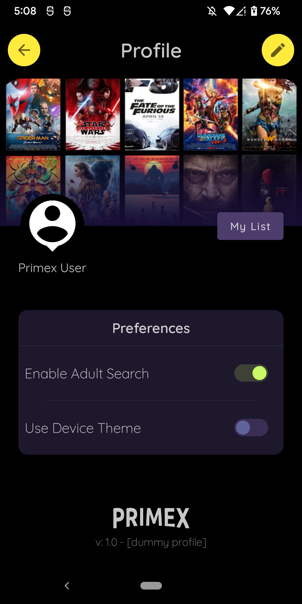

# PrimeX

### **Overview - About this project**
This is a simple Movie App using Clean Architecture (MVVM, Use Cases, Hilt)  and also Jetpack Compose to show a modern **UI/UX**

For this API is used:
- IMDB API
https://developer.imdb.com/

### 📷 How is this App
</img>
</img>
</img>
</img>

### 💻Technology
- [Kotlin](https://kotlinlang.org/)
- [Jetpack Compose](https://developer.android.com/jetpack/compose)
- [Dagger Hilt](https://dagger.dev/hilt/)

### References
This App was made as my learning process of Jetpack Compose, the original App and source code can be find here: 
- https://github.com/Ericgacoki
 
### Donation
If this project help you reduce time to develop, you can buy me a cup of coffee :) 

